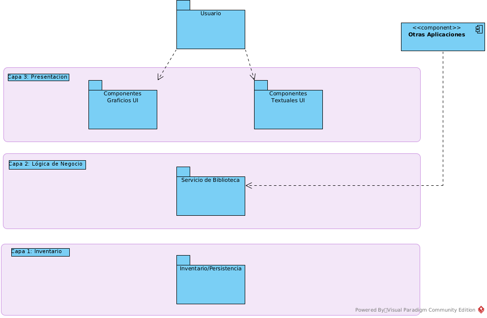
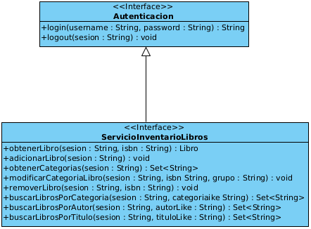

---
author:
- |
  Prof. Dr. Daniel San Martín\
  Electivo Patrones y Programación
title: Laboratorio II
---

**Fecha de Entrega: 11-12-2023 23:59\
Grupos de 3 estudiantes como máximo**\
URL Proyecto: <https://github.com/IS-LAB-EIC-UCN/LaboratorioII>

# Enunciado del segundo laboratorio

En las clases pasadas, en una primera etapa usted desarrolló un sistema
para ser implementado en OSGi, usando la plataforma Apache Felix, para
la administración de una biblioteca. El desarrollo consistió en la
creación de la capa de persistencia encargada de cargar, guardar, buscar
libros entre otras operaciones. La Figura
[1](#fig1){reference-type="ref" reference="fig1"} muestra un diagrama de
la arquitectura en tres capas del desarrollo a realizar.

{#fig1 width="80%"}

En una segunda etapa usted deberá implementar la lógica de negocio,
específicamente la capa de servicio,la cual, como indica su nombre
entregará pondrá a disposición los servicios de administración del
inventario a otras aplicaciones, como también a componentes de la capa
de presentación de la arquitectura en tres capas.

En particular, un proveedor externo implementó un componente de interfaz
de usuario en modo texto, que puede ser ejecutado en la consola `gogo`
de Apache Felix para las operaciones de buscar y adicionar libros. Por
lo tanto su tarea, además de implementar la capa de servicio, es la de
acoplar exitosamente esta capa con la capa de presentación.

La Figura [2](#fig2){reference-type="ref" reference="fig2"} muestra el
diagrama de clases con las clases necesarias para la implementación de
la capa de servicio. Existen dos interfaces que deben ser implementadas
para construir con éxito las funcionalidades, `Autenticación` y
`ServicioInventarioLibros`. La interfaz `Autenticación` ya se encuentra
implementada por lo que solo debe implementar
`ServicioInventarioLibros`.

{#fig2 width="50%"}

El sistema está compuesto por $4$ *bundles* o componentes y se detallan
a continuación:

-   `cl.ucn.felix.biblioteca.api`: API de la biblioteca para la
    definición del Inventario y Libro. (Capa 1)

-   `cl.ucn.felix.biblioteca.api.impl`: Implementación de la API. (Capa
    1)

-   `cl.ucn.felix.biblioteca.servicio`: Implementación de la capa de
    servicio. (Capa 2)

-   `cl.ucn.felix.biblioteca.servicio.tui`: Implementación de la
    interfaz de usuario textual. (Capa 3)

# Asignaciones de desarrollo

Para la correcta implementación de la capa de servicio usted deberá
completar el desarrollo de los siguientes códigos:

-   Clases/Interfaces

    -   `ExcepcionCredencialInvalida`,
        `ExcepcionSesionNoValidaTiempoEjecucion`,
        `ServicioInventarioLibroImpl` y `ServicioImplActivador`

-   Métodos (Clase `ServicioInventarioLibroImpl` )

    -   `obtenerGrupos`, `adicionarLibro`,

    -   `modificarCategoriaLibro`, `removerLibro`,
        `buscarLibrosPorCategoria`,

    -   `buscarLibrosPorAutor`, `buscarLibrosPorTitulo`

-   Métodos (Clase `ServicioImplActivador`)

    -   `start`, `stop`

Nota: Para las clases de Excepciones, solo debe completar las
instrucciones de los constructores.

# Instrucciones para compilación y deployment {#comp}

Una vez que haya finalizado correctamente los desarrollos, deberá seguir
los siguientes pasos para una compilación y deployment exitoso.

1.  Configurar correctamente su repositorio OBR para Apache Felix en
    todos los bundles.

2.  Compilar con *maven* cada bundle en orden (primero los de la capa 1,
    capa 2 y capa 3).

3.  Ingresar a Apache Felix (consola), cargar el repositorio y listar
    los bundles.

4.  Configurar el nivel inicial de los bundles al nivel 2 en la consola
    gogo de Felix Apache.

    -   `bundlelevel -i 2`

    -   `frameworklevel 2`

5.  Hacer *deployment* de los bundles de la capa de **persistencia**, y
    verificar el estado. Si todo está correcto deberían estar activos
    (**Active**).

6.  Configurar el nivel de los bundles al nivel 3 en la consola gogo de
    Felix Apache.

    -   `bundlelevel -i 3`

    -   `frameworklevel 3`

7.  Hacer *deployment* de los bundles de la capa de **servicio**, y
    verificar el estado. Si todo está correcto deberían estar activos
    (**Active**).

8.  Configurar el nivel de los bundles al nivel 5 en la consola gogo de
    Felix Apache.

    -   `bundlelevel -i 5`

    -   `frameworklevel 5`

9.  Hacer *deployment* de los bundles de la capa de **presentacion**, y
    verificar el estado. Si todo está correcto deberían estar activos
    (**Active**).

# Instrucciones para la entrega del proyecto

En la consola gogo de Felix Apache, usted puede listar todos los
comandos con la intrucción `help`. Si los pasos de la Sección
[3](#comp){reference-type="ref" reference="comp"} son correctos,
entonces usted debería visualizar los dos comandos que utilizará para
esta entrega `libro:adicionar` y libro:buscar. El primero adiciona un
libro al inventario y el segundo buscar un determinado libro, por algún
campo, incluso pudiendo usar wildcards.

Cada vez que usted haga un `help adicionar` o un `help buscar` en la
consola aparecerá la información del comando y los parámetros que debe
ingresar para usar el comando. Por lo tanto para una correcta entrega,
usted deberá:

1.  Ingresar por lo menos 5 libros, donde 2 pertenecerán a la misma
    categoría, usando
    `(username, password, ISBN, titulo, autor,categoría)`, donde
    username y password es *admin* para ambos.

2.  Buscar los libros que usted ingresó, usando
    `(username, password, atributo de la búsqueda, autor, titulo o categoría, match like %)`,
    donde username y password es *admin* para ambos.

Para demostrar que usted implementó correctamente el proyecto, deberá
crear un video de no mas de 5 minutos mostrando la ejecución del sistema
en Apache Felix, con los comandos antes mencionados.

Además, realizar una breve explicación del mecanismo que permite la
comunicación entre los bundles y cuales son los componentes que están
involucrados (o que se deben configurar) para que esto ocurra. Los
entregables de esta entrega son:

-   Código del proyecto en *GitHub*, enviar la url.

-   Vídeo de 5 minutos de duración como máximo.

Nota: El video debe estar alojado en el mismo sitio donde está alojado
el código, en la raíz del proyecto. Las urls, deberán ser entregadas por
CampusVirtual en el espacio
